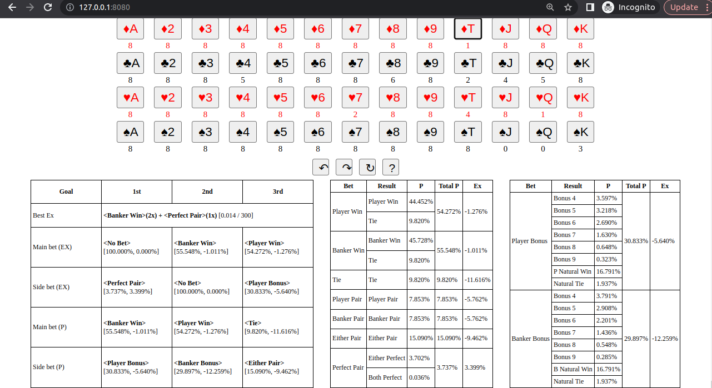

# Baccarat toolset
This repo contains some tools about **Baccarat**, the famous game played in all casinos. It can help you make wise decisions, by calculating probabilities and expectations.

You can download pre-compiled executables in GitHub Release. You can directly run the executable and open [localhost:8080](localhost:8080) with a browser to experience it. Below is a screenshot:



You can find the user manual in this Web APP by clicking the question mark button at the middle. You can configure the payouts and others in the config file. Refer to [sample_config.yml](./sample_config.yml) for more details.

The website assets (HTML, CSS, ...) are embeded in the executable, together with REST APIs, so it's easy to use. You can also make it listen other IP addresses or ports. For details, please run with `--help` or `-h`.

You can also build from souce. It's rather easy and only takes about 3 minutes. All you need are Rust (with Cargo and target `wasm-unknown-unknown`) and `trunk` (which can be installed via `cargo`. You can run the following commands to install the dependencies.
```
rustup target add wasm32-unknown-unknown
cargo install trunk
```

To build the backend and frontend of the Web APP (i.e., the Baccarat Assistant), refer to [build_assistant.sh](./build_assistant.sh) or [build_assistant.ps1](./build_assistant.ps1), which only contains 2 important commands.

## Repo structure

There are 4 tools in this repo:
- A library to calculate probabilities and expectations. Other Rust code can call functions within this library.
- A Web backend service to provide calculation service through REST API.
- A simple Web frontend to call REST API and give user suggestions on which you should bet (or not bet at all, since the expectation at most time is negative).
- A command line tool to simulate Baccarat games. It can simulate hundreds of thousands of rounds per second.

For documentation of each tool, please refer to README under its directory.

Note that this project is only for studying purpose.
